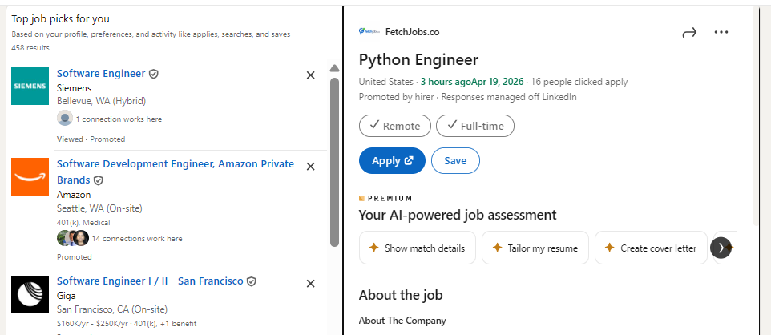

# LinkedIn Exact Date Restorer

> Replaces LinkedIn's vague relative timestamps with exact dates — instantly, everywhere, no login required.




---

## The problem

LinkedIn shows job postings and feed activity as **"3 weeks ago"** or **"1 month ago"**. This makes it impossible to know if a role was posted on April 3rd or March 15th — a difference that matters when deciding whether to apply.

## What this does

Scans every relative timestamp on LinkedIn and replaces it with a real date.

| Before | After |
|--------|-------|
| Posted 3 weeks ago | Posted Apr 3, 2026 |
| Reposted 1 day ago | Reposted Apr 17, 2026 |
| Viewed · 2 weeks ago | Viewed · Apr 4, 2026 |
| 1 month ago | Mar 18, 2026 |

Works on job listings, feed posts, connection requests, and comments. Updates automatically as you navigate LinkedIn's SPA without page reloads.

---

## Install

### Chrome / Edge / Chromium

1. Download and unzip the [latest release](../../releases/latest)
2. Go to `chrome://extensions` and enable **Developer mode**
3. Click **Load unpacked** → select the unzipped folder

### Firefox

Coming soon.

---

## Features

- **Instant replacement** — dates appear as the page loads, no delay
- **SPA-aware** — works across LinkedIn's client-side navigation
- **Two date formats** — `Apr 3, 2026` or `2026-04-03` (ISO)
- **Toggle on/off** — disable without uninstalling via the popup
- **Zero tracking** — no analytics, no external requests, no data collection
- **Minimal permissions** — only `storage` and LinkedIn host access

---

## How it works

LinkedIn renders relative dates as human-readable text ("3 weeks ago"). This extension reads that text directly from the DOM, calculates the approximate date using `Date.now()`, and replaces it via CSS — without touching LinkedIn's React component tree.

```
"3 weeks ago"  →  Date.now() - (3 × 604800000ms)  →  "Apr 3, 2026"
```

No API calls. No authentication. No server. Just math.

**Accuracy:** Within the resolution of LinkedIn's own rounding. "1 day ago" lands within 24 hours of the actual timestamp. "2 weeks ago" lands within 7 days. For job searching purposes — where you're evaluating freshness, not auditing timestamps — this is exact enough.

---

## Privacy

- All processing happens locally in your browser
- No data leaves your machine
- No cookies read or written
- No network requests made by the extension

---

## Permissions

| Permission | Why |
|-----------|-----|
| `storage` | Saves your format preference (long vs ISO) |
| `host_permissions: linkedin.com` | Required to run the content script on LinkedIn pages |

---

## Development

```bash
git clone https://github.com/yourusername/linkedin-exact-date-restorer
```

```
linkedin-exact-date-restorer/
├── manifest.json
├── popup.html
├── src/
│   ├── content.js   # DOM scanner + date replacer
│   └── popup.js     # Settings toggle
└── icons/
```

Load unpacked from `chrome://extensions` with Developer mode enabled.

---

## Contributing

Bug reports and PRs welcome. If LinkedIn updates their DOM structure and selectors break, open an issue with the page URL and affected element HTML.

---

## License

MIT
